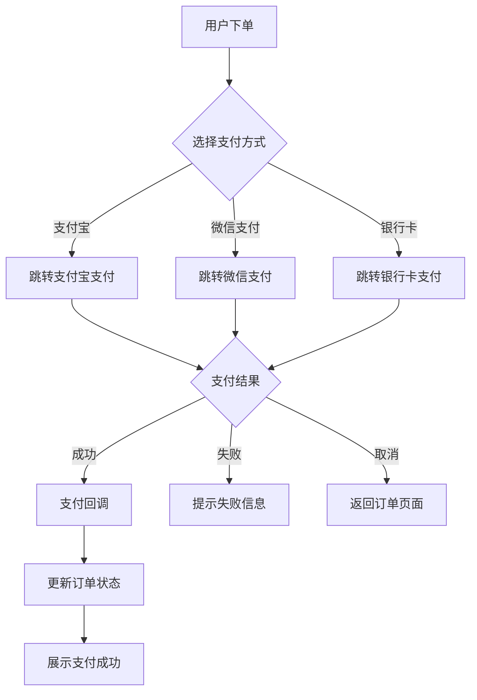
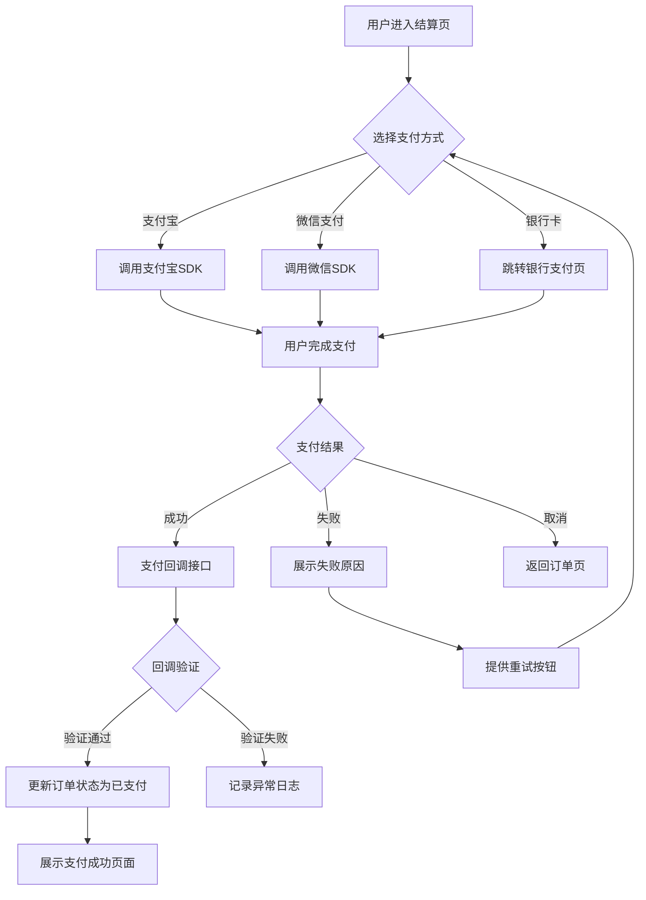
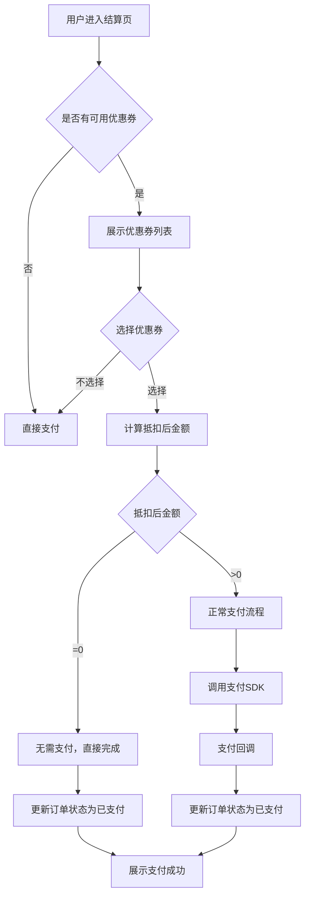
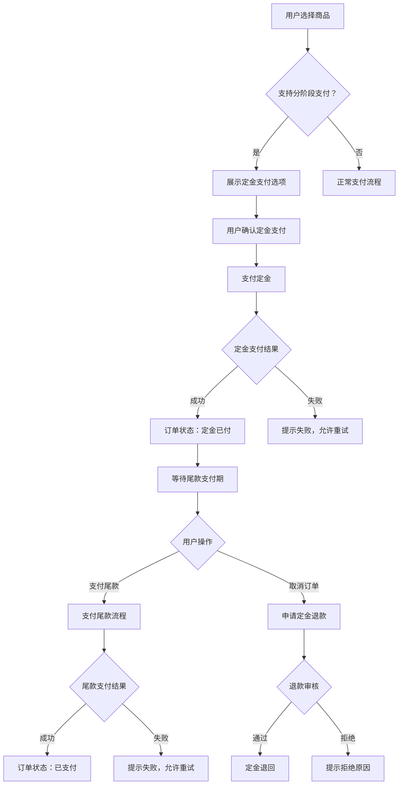
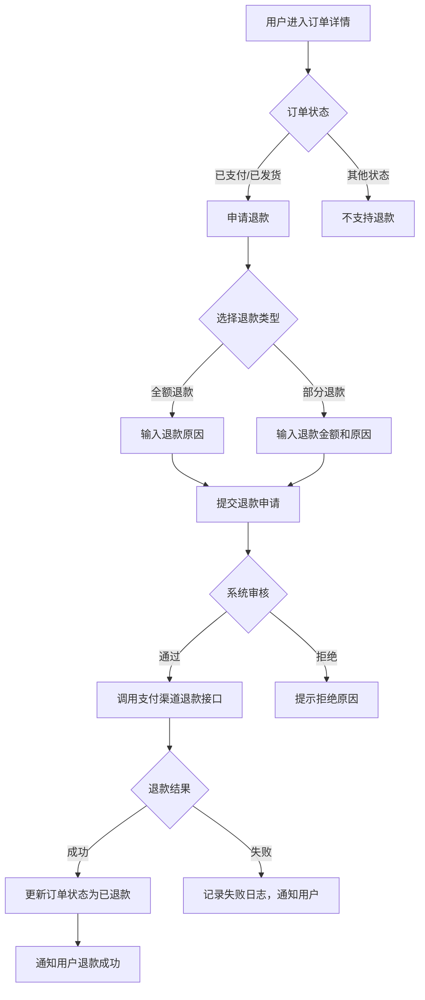

# 支付模块测试用例文档

## 1. 需求分析

### 1.1 需求概述
根据业务描述，支付模块需支持以下核心能力：

| 需求类别 | 具体内容 |
| :--- | :--- |
| **支付方式** | 支付宝、微信支付、银行卡（混合模式） |
| **核心流程** | 标准支付、优惠券抵扣、退款、分阶段支付（定金+尾款） |
| **业务规则** | 最小/最大支付金额限制、单笔/单日支付限额、满减/折扣优惠 |
| **异常场景** | 网络超时、支付失败、重复支付、取消支付 |

### 1.2 业务流程概述

---

## 2. 测试用例

### 2.1 标准支付流程测试

| 用例ID | 测试场景 | 前置条件 | 测试步骤 | 预期结果 | 优先级 |
| :--- | :--- | :--- | :--- | :--- | :--- |
| TC-PAY-001 | 支付宝支付成功 | 用户已登录，购物车有商品，账户余额充足 | 1. 选择商品下单 2. 选择支付宝支付 3. 完成支付 | 支付成功，订单状态更新为"已支付" | 高 |
| TC-PAY-002 | 微信支付成功 | 用户已登录，购物车有商品，账户余额充足 | 1. 选择商品下单 2. 选择微信支付 3. 完成支付 | 支付成功，订单状态更新为"已支付" | 高 |
| TC-PAY-003 | 银行卡支付成功 | 用户已登录，购物车有商品，银行卡余额充足 | 1. 选择商品下单 2. 选择银行卡支付 3. 输入卡号等信息 4. 完成支付 | 支付成功，订单状态更新为"已支付" | 高 |
| TC-PAY-004 | 支付金额等于最小值 | 用户已登录，商品金额等于最小支付金额 | 1. 选择金额为最小限额的商品 2. 选择任意支付方式 3. 完成支付 | 支付成功，订单状态更新为"已支付" | 中 |
| TC-PAY-005 | 支付金额等于最大值 | 用户已登录，商品金额等于最大支付金额 | 1. 选择金额为最大限额的商品 2. 选择任意支付方式 3. 完成支付 | 支付成功，订单状态更新为"已支付" | 中 |

### 2.2 优惠券抵扣测试

| 用例ID | 测试场景 | 前置条件 | 测试步骤 | 预期结果 | 优先级 |
| :--- | :--- | :--- | :--- | :--- | :--- |
| TC-PAY-011 | 使用优惠券支付 | 用户已登录，有可用优惠券，订单金额满足使用条件 | 1. 选择商品下单 2. 选择可用优惠券 3. 完成支付 | 支付金额正确抵扣，订单状态更新为"已支付" | 高 |
| TC-PAY-012 | 优惠券金额等于订单金额 | 用户已登录，优惠券金额=订单金额 | 1. 选择商品下单（金额=优惠券金额） 2. 选择优惠券 3. 完成支付 | 实付金额为0，支付成功 | 中 |
| TC-PAY-013 | 优惠券金额大于订单金额 | 用户已登录，优惠券金额>订单金额 | 1. 选择商品下单（金额<优惠券金额） 2. 选择优惠券 3. 完成支付 | 实付金额为0，优惠券剩余金额不退 | 中 |
| TC-PAY-014 | 优惠券过期不可用 | 用户已登录，优惠券已过期 | 1. 选择商品下单 2. 尝试选择过期优惠券 | 系统提示优惠券已过期，无法使用 | 中 |

### 2.3 分阶段支付测试（定金+尾款）

| 用例ID | 测试场景 | 前置条件 | 测试步骤 | 预期结果 | 优先级 |
| :--- | :--- | :--- | :--- | :--- | :--- |
| TC-PAY-021 | 支付定金成功 | 用户已登录，选择支持定金支付的商品 | 1. 选择商品下单 2. 选择分阶段支付 3. 支付定金 | 定金支付成功，订单状态更新为"定金已付" | 高 |
| TC-PAY-022 | 支付尾款成功 | 用户已支付定金，尾款支付时间未过期 | 1. 进入订单详情 2. 点击支付尾款 3. 完成支付 | 尾款支付成功，订单状态更新为"已支付" | 高 |
| TC-PAY-023 | 定金支付失败后重试 | 用户已登录，定金支付失败 | 1. 选择商品下单 2. 选择分阶段支付 3. 支付定金失败 4. 重新支付定金 | 重新支付成功，订单状态更新为"定金已付" | 中 |

### 2.4 退款流程测试

| 用例ID | 测试场景 | 前置条件 | 测试步骤 | 预期结果 | 优先级 |
| :--- | :--- | :--- | :--- | :--- | :--- |
| TC-PAY-031 | 全额退款成功 | 用户已完成支付，订单支持退款 | 1. 进入订单详情 2. 申请全额退款 3. 确认退款 | 退款成功，订单状态更新为"已退款" | 高 |
| TC-PAY-032 | 部分退款成功 | 用户已完成支付，订单支持部分退款 | 1. 进入订单详情 2. 申请部分退款（输入金额） 3. 确认退款 | 部分退款成功，剩余金额保留 | 中 |
| TC-PAY-033 | 使用优惠券后退款 | 用户使用优惠券支付后申请退款 | 1. 使用优惠券完成支付 2. 申请退款 | 退款金额为实际支付金额，优惠券不退 | 中 |
| TC-PAY-034 | 分阶段支付定金退款 | 用户已支付定金，未支付尾款 | 1. 支付定金成功 2. 申请定金退款 | 定金退款成功，订单状态更新为"已取消" | 中 |

### 2.5 异常场景测试

| 用例ID | 测试场景 | 前置条件 | 测试步骤 | 预期结果 | 优先级 |
| :--- | :--- | :--- | :--- | :--- | :--- |
| TC-PAY-041 | 支付金额小于最小值 | 用户已登录，商品金额<最小支付金额 | 1. 选择商品下单（金额<最小值） 2. 尝试支付 | 系统提示"支付金额低于最小限额" | 高 |
| TC-PAY-042 | 支付金额大于最大值 | 用户已登录，商品金额>最大支付金额 | 1. 选择商品下单（金额>最大值） 2. 尝试支付 | 系统提示"支付金额超过最大限额" | 高 |
| TC-PAY-043 | 网络超时重试 | 用户已登录，模拟网络超时环境 | 1. 选择商品下单 2. 选择支付方式 3. 触发网络超时 4. 点击重试 | 重试成功，支付完成 | 高 |
| TC-PAY-044 | 支付失败（余额不足） | 用户已登录，账户余额不足 | 1. 选择商品下单（金额>余额） 2. 完成支付 | 支付失败，提示"余额不足" | 高 |
| TC-PAY-045 | 重复支付同一订单 | 用户已完成支付 | 1. 进入已支付订单详情 2. 尝试再次支付 | 系统提示"订单已支付，请勿重复操作" | 高 |
| TC-PAY-046 | 用户取消支付 | 用户进入支付页面 | 1. 选择商品下单 2. 进入支付页面 3. 点击取消 | 返回订单页面，订单状态为"待支付" | 中 |
| TC-PAY-047 | 支付限额测试（单笔） | 用户已登录，订单金额>单笔限额 | 1. 选择商品下单（金额>单笔限额） 2. 尝试支付 | 系统提示"超过单笔支付限额" | 中 |
| TC-PAY-048 | 支付限额测试（单日） | 用户已达到单日支付限额 | 1. 累计支付达到单日限额 2. 尝试再次支付 | 系统提示"已达到今日支付限额" | 中 |

### 2.6 边界条件测试

| 用例ID | 测试场景 | 前置条件 | 测试步骤 | 预期结果 | 优先级 |
| :--- | :--- | :--- | :--- | :--- | :--- |
| TC-PAY-051 | 支付金额为0（使用全额优惠券） | 用户已登录，有全额优惠券 | 1. 选择商品下单 2. 使用全额优惠券 3. 完成支付 | 支付成功，实付金额为0 | 中 |
| TC-PAY-052 | 支付金额为最小单位（0.01元） | 用户已登录，商品金额为0.01元 | 1. 选择商品下单（0.01元） 2. 完成支付 | 支付成功，订单状态更新为"已支付" | 低 |
| TC-PAY-053 | 超长订单号支付 | 用户已登录，模拟超长订单号 | 1. 生成超长订单号的订单 2. 尝试支付 | 支付正常进行，无异常 | 低 |

---

## 3. 核心流程流程图

### 3.1 标准支付流程图

### 3.2 优惠券支付流程图

### 3.3 分阶段支付流程图

### 3.4 退款流程图

---

## 4. 测试环境要求

| 环境类型 | 要求 |
| :--- | :--- |
| **网络环境** | 正常网络、弱网、断网模拟 |
| **支付渠道** | 支付宝沙箱、微信支付测试号、银行卡测试环境 |
| **数据准备** | 不同金额的商品、各种类型优惠券、不同状态的订单 |
| **设备覆盖** | PC端、移动端（iOS/Android） |

---

## 5. 测试工具建议

| 工具类型 | 推荐工具 | 用途 |
| :--- | :--- | :--- |
| **接口测试** | Postman/Charles | 模拟支付回调、接口联调 |
| **性能测试** | JMeter/Gatling | 高并发支付场景 |
| **移动端测试** | Appium | 移动端支付流程测试 |
| **网络模拟** | Fiddler/Charles | 模拟网络超时、弱网 |
